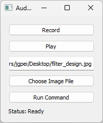

# Gpt_Builder

Gpt_Builder is a Python application that harnesses the power of GPT (Generative Pre-trained Transformer) to build customized applications based on user descriptions provided through audio recordings and drawings. This README.md file serves as a guide for users and developers interested in understanding, using, or contributing to the Gpt_Builder project.

## How It Works

1. **User Input:**
   - The user starts by recording an audio description and creating a drawing that outlines the desired application.

2. **Audio to Text Conversion:**
   - Utilizing the Whisper Text-To-Speech model, the audio is converted into text.

3. **Requirement Extraction:**
   - The text is processed with GPT-3.5 to create a list of functional requirements using the format: REQ_ID, TYPE, DESCRIPTION.

4. **UI Sketch Analysis:**
   - The drawn image is analyzed with GPT-4-Vision to generate a list of UI requirements using the format: WIDGET_ID, TYPE, LAYOUT, DESCRIPTION.

5. **Code Generation:**
   - Both sets of requirements are combined to generate the code for the requested application with GPT-4.

